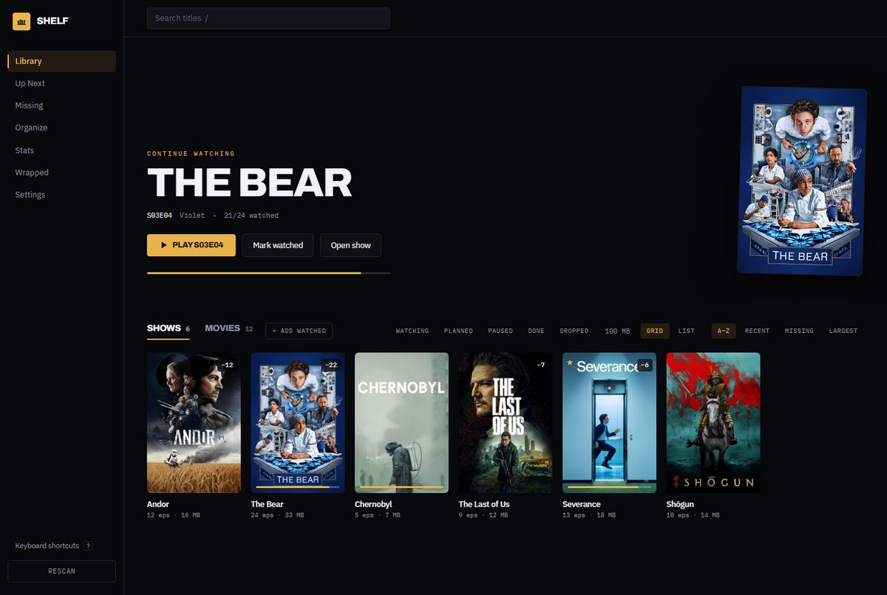
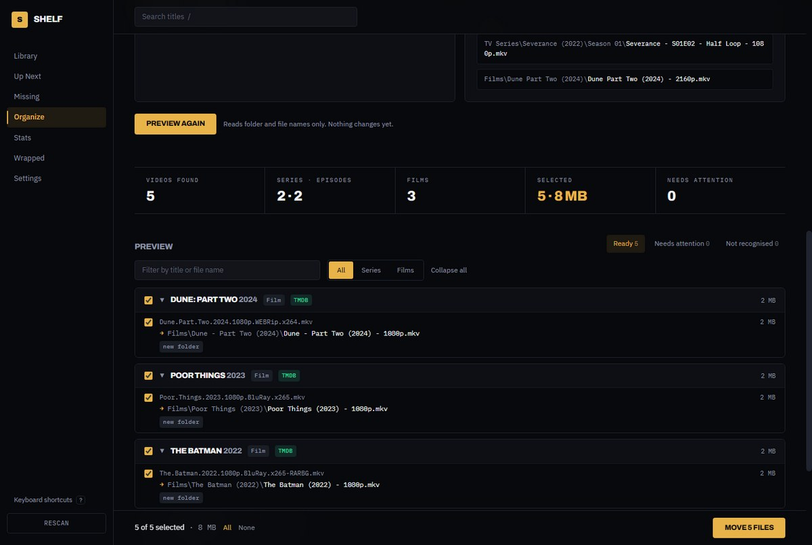
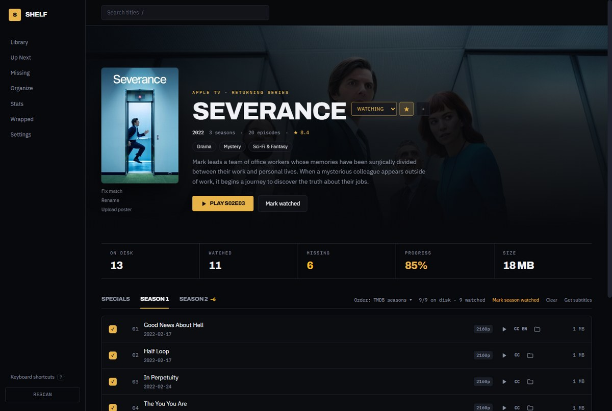
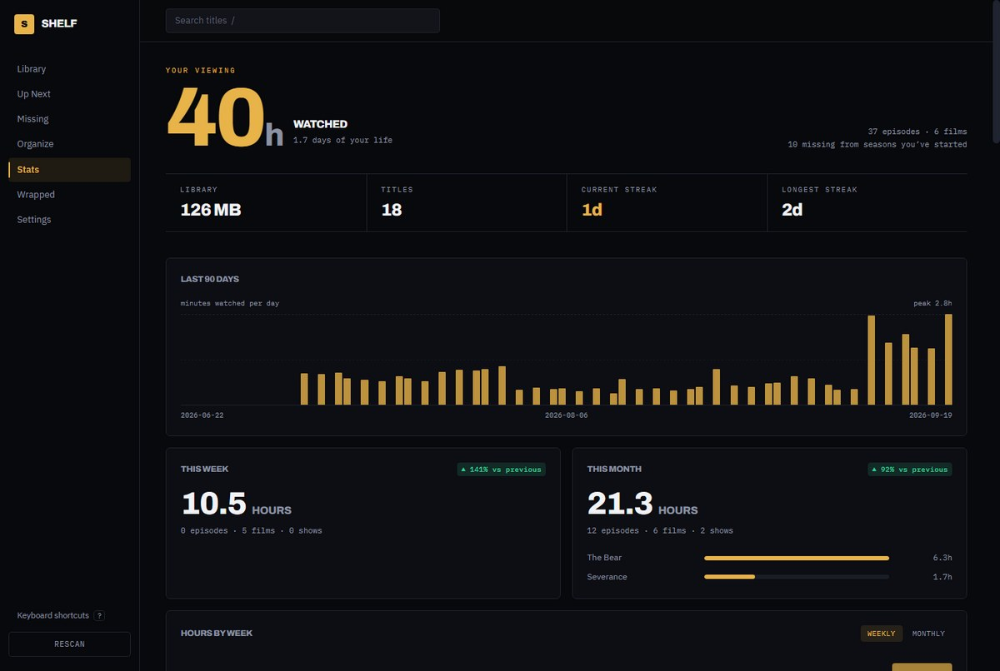

<div align="center">


# Shelf

**A local-first tracker for the TV and film library you already have on disk.**

No account. No cloud. No ads. Nothing leaves your computer.

[Download for Windows](../../releases/latest) ·
[What it does](#what-it-does) ·
[Organizer](#organize-your-files) ·
[Buy me a coffee](https://ko-fi.com/picklerobot)



</div>

Most trackers know what you *watched*. Shelf also knows what you **own** — so it can
tell you that you're missing `From S04E05–E06`, that three files are fighting over
`Spider-Man S01E00`, and that Vikings is quietly eating 19 GB.

Your files are never moved or renamed unless you preview and approve it in the organiser.

### Organize your files

Point it at a downloads folder. It works out what each video is from its name, shows you
exactly where every file would go, and moves only what you tick. Every batch can be undone.

Already happy with where your files live? Choose **Rename only** and nothing moves: each file
keeps the folder it is in and only its name changes, in whatever shape you pick.



### Browse by genre

A **Genres** tab beside Shows and Films, with series and films on the same shelf. TMDB names
television genres differently from film ones — "Action & Adventure" against "Action" — so
those are folded together; browsing for something to watch should not care which is which.

### Know what you have, and what is missing



### See where the hours went



## What it does

**Library**
- Scans your folders and indexes every episode and film
- Handles real-world release names — `[MPM-EZI]The.End.of.the.Fucking.World.S01E01.720p.x265.mkv`
  and `[TIF]_S02_E01_Fargo_720p_10bit.mkv` both parse correctly
- Splits grouping folders: a `Documentaries/` folder holding six docuseries becomes six shows,
  not one show with colliding episode numbers

**Missing episodes and duplicates**
- With a TMDB key: compares your files against the real episode list
- Without one: detects holes in your file numbering, so the feature works on first run
- Finds duplicate copies, suggests the best one (resolution, HDR, languages) and can send the
  others to the Recycle Bin after you confirm. Files of different lengths are treated as
  misnumbered episodes, never as copies
- "Wrong episode?" corrects which episode a badly named file is

**Real file details**
- Reads each file's actual resolution, HDR, length, and audio and subtitle languages with
  ffprobe (bundled in the Windows app), and uses the title stored inside files whose names say
  nothing

**Watch tracking**
- Mark episodes or whole seasons watched; rate episodes and films and keep notes
- Played from Shelf in VLC, mpv or MPC-HC, episodes resume where you stopped and are marked
  watched once most of the file has played
- "Continue Watching" surfaces the exact next episode per show
- Countdown timers to upcoming air dates, and a desktop notification when a new episode of a
  show in your library airs
- Import your history from a TV Time data export, and sync both ways with Trakt
- Back up everything you've added to one file and restore it on another computer

**Stats**
- Watch-time meter, daily activity chart, current and longest streak
- Weekly and monthly recaps with week-over-week deltas
- Library composition: genres, quality mix, biggest space hogs
- Year-in-review ("Wrapped")

**Organiser** (the one part that writes to your disk)
- Point it at any folder or whole drive and pick where TV series and films should go
- Works out what each video is from its name and the folders around it — no AI, no upload.
  With a TMDB key it also fixes typos and adds official episode names
- Builds `Show (Year)/Season 01/Show - S01E02 - Episode - 1080p.mkv` and
  `Film (Year)/Film (Year) - 2160p.mkv`; choose which parts go in the names, or keep the
  original file names and only sort them into folders
- Move or copy. Across drives a move is copy, verify, then remove the original
- Subtitles named after a video travel with it; samples and phone clips are left alone
- Existing show, season and collection folders in the destination are reused as they are
- Full preview with filters and per-file checkboxes; duplicates and name clashes are shown
  and never overwritten. Every batch is logged and undoable
- **Tidy my library** re-checks your libraries in one click (new episodes that landed
  outside their season folder, loose films)
- **Automatic organizing** watches folders such as Downloads on a schedule (5 minutes to
  6 hours). It moves only files it is sure about (an episode marker or a film year in the
  name, confirmed by TMDB when a key is set) and leaves the rest for review; or it can just
  report. Files still being written (`.part`, `.!qB`, `.aria2`, … or changed in the last
  few minutes) are never touched
- The desktop app can keep running in the system tray and start with Windows, with a
  notification after each automatic run

**Playback and subtitles**
- Play any episode or film from Shelf in the system default player or a chosen one (VLC,
  MPC-HC, PotPlayer, mpv and others are detected)
- "Show in folder" for any file
- Subtitle files next to your videos are detected and shown per episode
- Search and download subtitles from OpenSubtitles.com with your own free API key, best
  matches first (a file-hash match is made for that exact release)

**Make it yours**
- Cinematic interface: backdrop heroes, poster walls, Archivo display type
- Six hand-tuned themes — Projection, Nitrate, Midnight, Kodachrome, Noir and Daylight
- A theme builder with live preview, a contrast check on every colour pair, and JSON
  export/import so themes can be shared
- Drop any image on a show or film to set a custom poster, or give it an emoji icon
- Titles without artwork get a generated poster (their own hue, a monogram, film grain)
  rather than a grey box

## Offline, and small

**Shelf works with the network unplugged.** Scanning, organizing, renaming, tracking what you
have watched, statistics, backups — all of it is local, and none of it waits on a connection.
TMDB adds artwork, official titles and episode names; lose the connection and you lose those,
nothing else. Titles that could not be looked up are left to try again rather than written
off, so an outage never poisons the library, and every outbound call has a deadline so a
half-open connection cannot hang the app. There is a test that runs the whole thing with
every network call failing: `server/test/offline.test.mjs`.

**It stays small.** Your videos are never copied or moved except by the organizer, when you
approve it. What Shelf keeps is the index, plus artwork cached at the size it is shown —
posters at 342px, backdrops at 780px, nothing larger. A library of 18 titles and 85 files
costs about **1.5 MB**: roughly 700 KB of index and 800 KB of artwork. **Settings → Disk used
by Shelf** shows the real number and gives back what it can: artwork for titles you no longer
have, and the database's own slack.

## Requirements

Node.js 22.5+ (uses the built-in `node:sqlite` — no native modules, no build tools).

## Running it

```bash
npm run setup
```

Then two terminals:

```bash
npm run dev:server
```

```bash
npm run dev:client
```

Open <http://localhost:5180>.

Then in **Settings**, add your library folders (one for TV, one for Movies) and hit **Scan**.

Things you watched but do not have on this computer go in with **+ Add watched** on the
Library. They join the library as titles with no files: tick off episodes, rate them, and
they count in your statistics like anything else. Delete a download later and the record
stays; download it again and the title you were already following picks the files up
rather than appearing twice.

Without a TMDB key the Library opens as a plain list — name, folder or file, what you have
watched, size — because a grid of empty poster frames tells you nothing. **Grid** and **List**
sit beside the sort buttons, and whichever you pick is remembered.

A scan only picks up video files that look like an episode or a film. Subtitles are noted
beside their video; documents, artwork, music and archives are ignored outright; and
release samples, trailers and phone or camera exports (`VID_20240102…`, WhatsApp
downloads, screen recordings) are left out and counted in the scan summary. Hidden files
and folders are never opened — the Windows hidden attribute and dot-names both count, and
nothing inside a hidden folder is reached at all. Anything else
you would rather not index — courses, recordings, work files — goes in **Ignored folders**.

## Desktop app

The same codebase ships as a desktop app — Electron just hosts the Express server on an
ephemeral port and points a window at it.

```bash
npm start          # run the desktop app
npm run dist       # build installers into dist-desktop/, with checksums
```

On Windows that produces `Shelf Setup 0.1.0.exe` (installer) and `Shelf 0.1.0.exe` (portable),
~120 MB each, plus `SHA256SUMS.txt` and `RELEASE-NOTES.md` to go with the release.

The desktop build keeps its database and uploaded posters in `%APPDATA%/Shelf/`, entirely
separate from the dev server's `server/data/`. A fresh install opens a short setup guide:
choose folders, optionally add a TMDB key, scan.

The app icon lives in `build/icon.png` and `build/icon.ico`. Both are generated from the
Shelf mark by `npm run icon`, so to change the icon, edit `scripts/make-icon.cjs` and rerun.

> Electron 42 bundles Node 24, which is what makes the built-in `node:sqlite` work. Electron 33
> and older bundle Node 20 and will fail to start.

### Installing on Windows

**Windows will say "Windows protected your PC" the first time you run Shelf.** Click
**More info**, then **Run anyway**.

That warning means the file is unsigned, not that anything is wrong with it. A code signing
certificate costs more per year than this project takes in donations, and Shelf is free and
staying free, so the certificate is not a good use of anyone's money.

What you get instead is a checksum for every file. Compare the one you downloaded against
`SHA256SUMS.txt` on the release:

```powershell
Get-FileHash "Shelf Setup 0.1.0.exe" -Algorithm SHA256
```

If the hash matches, the file is exactly what was built from this repository. If it does not,
delete it and download again from the releases page — never from anywhere else.

## Development

```bash
npm --prefix server test
```

Runs the filename-parser, TMDB-matching, organiser and subtitle tests, built from real release names —
including the underscore-separated and `[GROUP]_S02_E01_Title` layouts that broke earlier
versions.

```bash
npx electron scripts/snap.cjs
```

With both dev servers running, screenshots every route into `snaps/` using Electron's own
renderer — handy for README images, or for checking a theme without opening a browser.
`SNAP_ROUTES`, `SNAP_W`, `SNAP_H` and `SNAP_OUT` override the defaults.

## TMDB (optional)

Shelf works with zero configuration. Adding a free
[TMDB API key](https://www.themoviedb.org/settings/api) in **Settings → Metadata** unlocks
posters, backdrops, official titles, real episode lists, air dates and accurate
missing-episode detection. Either credential TMDB shows you works — the short *API Key*
or the long *Read Access Token*.

- **Fetch posters & metadata** runs in the background with a progress bar.
- Matching is typo-tolerant: it combines episode filenames, the folder name and fallback
  searches, so folders like `Tha Raincoat Killer` or `FIght Night The Million Doller heist`
  still find the right series and are shown under their official names.
- Anything matched wrongly, or not at all, can be corrected from its page with **Fix match**;
  **Rename** changes the name shown in Shelf without touching files on disk.
- Artwork is downloaded once into `server/data/cache/images/` (`%APPDATA%/Shelf/cache/images/`
  in the desktop app) and served locally, so posters keep working offline.

The key is stored in your local database and used only to call TMDB. In the desktop app
it — and your OpenSubtitles and Trakt credentials — are encrypted for your Windows
account, so a copy of the database or a backup of it gives nothing away. Running the
server on its own cannot read those, so set `TMDB_API_KEY` in the environment for
development.

## How it's built

```
server/    Express 5 + node:sqlite
  src/scanner/parse.js   filename -> {title, season, episode, quality, codec}
  src/scanner/scan.js    walks libraries, upserts shows/episodes/files
  src/queries.js         library views, missing report, continue-watching
  src/stats.js           watch time, streaks, recaps, wrapped
  src/tmdb.js            metadata client, degrades to null with no API key

client/    React 19 + Vite + Tailwind v4
```

The server exports `createApp()` without listening, so it can be wrapped in Electron later
without restructuring. Writable paths are env-overridable
(`SHELF_DB_PATH`, `SHELF_UPLOADS_DIR`, `SHELF_DATA_DIR`).

### Design notes

- **Read-only by default.** The scanner only ever reads. Watch state and customisations live
  in `server/data/shelf.db`, never in your library folders.
- **Placeholder episode rows.** Scanning creates episode rows from filenames alone, so gap
  detection works before TMDB is ever configured.
- **Deepest-root wins.** When show folders nest, a file is claimed by the most specific
  folder containing it.
- **The organiser is preview-first.** `planImport()` only reads; applying needs the id of
  that exact preview, the chosen file ids and `confirm: true`. Intent is written to
  `file_operations` *before* each move, so an interrupted run still leaves an undo trail.
- **Local only.** The server listens on 127.0.0.1, sends no CORS headers, and refuses
  requests whose `Host` or `Origin` is not this computer, because it can move files and start
  a video player.

## Status

Working: scanning, library browsing, show/film detail, watch tracking, missing + duplicate
detection, stats, Wrapped, the organiser, custom posters, theming, TMDB matching.

Also working: Windows desktop packaging with its own icon, a first-run setup guide, playing
files in your player, and subtitle detection and download.

Not built yet: code signing and published releases (automatic updates are wired to GitHub
releases and switch on once releases exist).

The app adapts to narrow windows and has keyboard shortcuts (press `?`).

## Support Shelf

Shelf is free and always will be. If it saved you an evening of renaming files, you can
[buy me a coffee](https://ko-fi.com/picklerobot). Bug reports and pull requests are just as
welcome.

## License

Shelf is released under the MIT License (see [LICENSE](LICENSE)). You may use, change and
redistribute it, including commercially, as long as the copyright notice stays.

The software Shelf ships with keeps its own licences — 107 packages, listed in
[THIRD-PARTY-NOTICES.md](THIRD-PARTY-NOTICES.md) and readable inside the app under
Settings → About:

- **ffprobe** (FFmpeg project) is bundled with the Windows build under the **GPL-3.0**
  ([licence text](licenses/GPL-3.0.txt)). Shelf runs it as a separate program to read file
  details; its source is at <https://ffmpeg.org/download.html> and
  <https://www.gyan.dev/ffmpeg/builds/>. Drop the `@ffprobe-installer/win32-x64` optional
  dependency to build without it.
- **Electron, React, Express, Vite, Tailwind** and most of the rest are MIT.
- **Archivo** and **IBM Plex** are under the SIL Open Font License 1.1.

### Services

Shelf works offline; these need your own key or account, and each has its own terms:

- **TMDB** — this product uses the TMDB API but is not endorsed or certified by TMDB. The free
  API licence covers personal, non-commercial use; a commercial product needs a separate
  agreement with TMDB.
- **OpenSubtitles** — searching and downloading runs under your own account and daily limits.
- **Trakt** — sync uses a Trakt API application you create, and a Trakt account.

Shelf never downloads or streams video. It organises and tracks files you already have.
